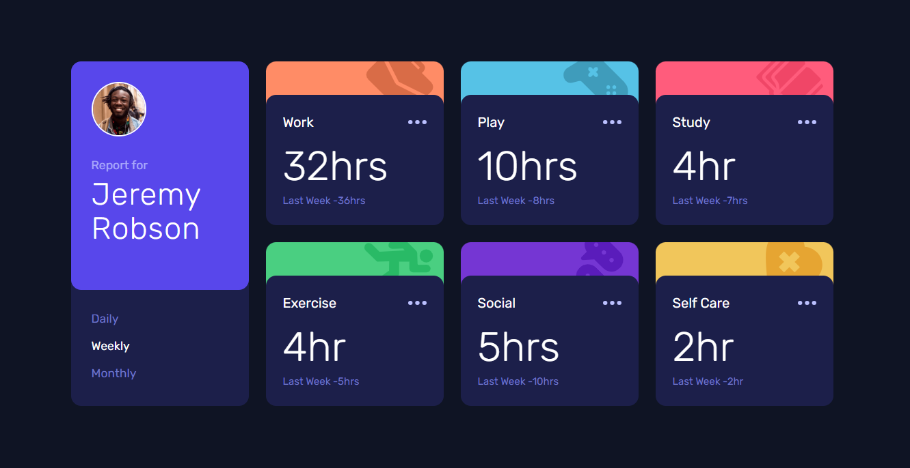

# Frontend Mentor - Time tracking dashboard solution

This is a solution to the [Time tracking dashboard challenge]

## Table of contents

- [Overview](#overview)
  - [The challenge](#the-challenge)
  - [Screenshot](#screenshot)
  - [Links](#links)
- [My process](#my-process)
  - [Built with](#built-with)
  - [What I learned](#what-i-learned)
- [Author](#author)

## Overview

### The challenge

Users should be able to:

- View the optimal layout for the site depending on their device's screen size
- See hover states for all interactive elements on the page
- Switch between viewing Daily, Weekly, and Monthly stats

### Screenshot

### Links

- Solution URL: [Solution Github](hhttps://github.com/Manufacturer1/time-tracking-dashboard-app)
- Live Site URL: [Vercel Host](https://time-tracking-dashboard-app-eta.vercel.app/)

## My process

### Built with

- Semantic HTML5 markup
- CSS custom properties
- CSS Grid
- Mobile-first workflow
- [React](https://reactjs.org/) - JS library
- [Tailwind](https://tailwindui.com/) - React framework

### What I learned

I've learned a lot about how to manage components, how to create resuable components in React and a little bit of css grid.
Also i'm pretty proud of finding a solution to style the dashboard-card-component wich took me a pretty good amount of time finding an optimal soulution.

## Author

- Website - [Manufacturer1](https://github.com/Manufacturer1/time-tracking-dashboard-app)
